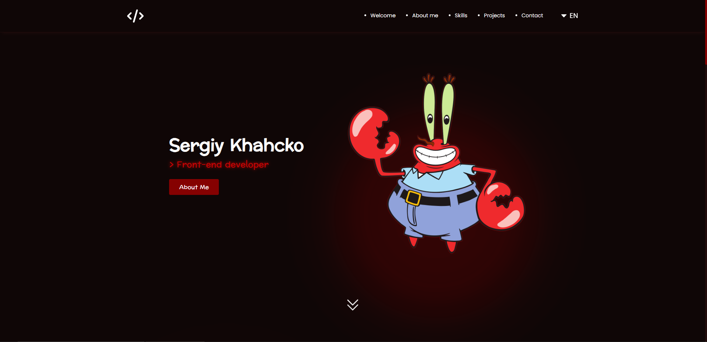

# **Interactive comments section | by zukicode**

_My portfolio, created by me, in it I used all the knowledge I have, it helped me to understand more about interacting with the server, with forms, with TypeScript, namely with types, I also better understood how to create custom hooks, and of course I became better than I was yesterday._

**Screenshot from website.**

#### Tech Stack:

1.  React
2.  Redux Toolkit
3.  TypeScript
4.  SCSS
5.  SCSS Modules

_Thank you for your attention!_
